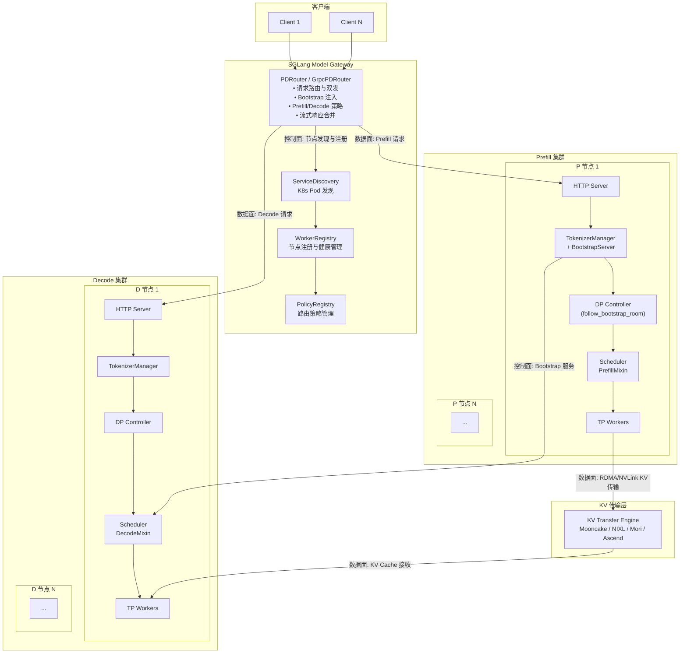
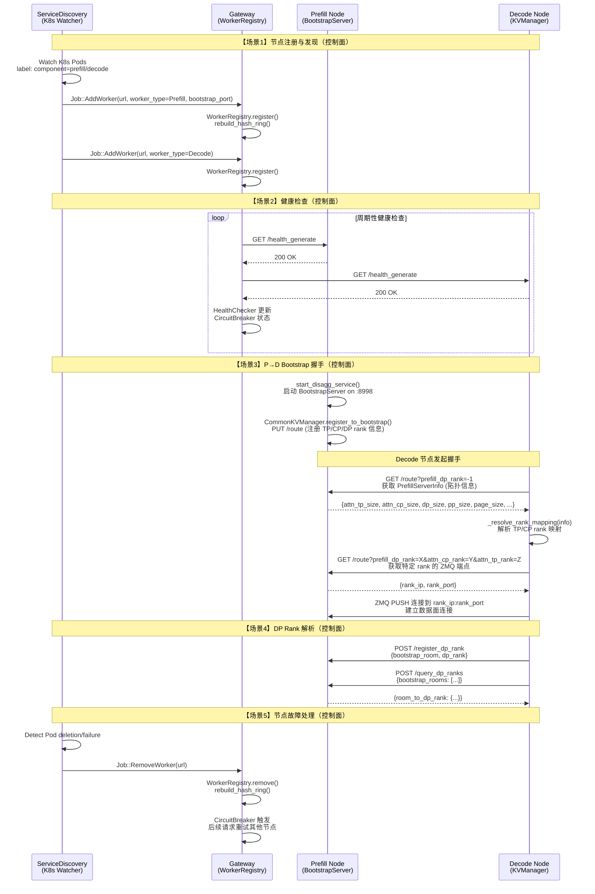
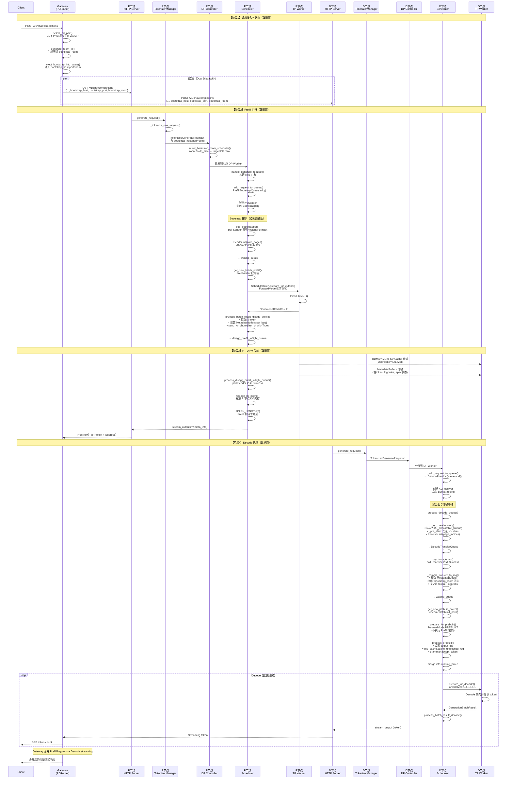
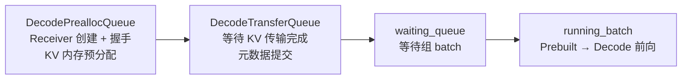
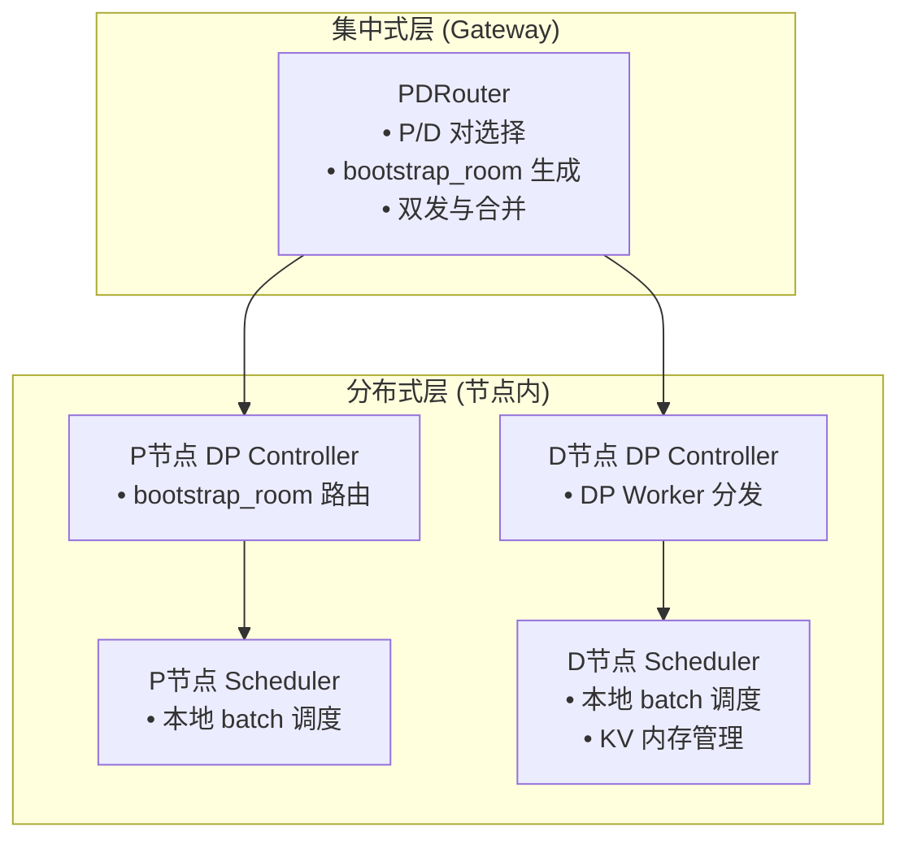
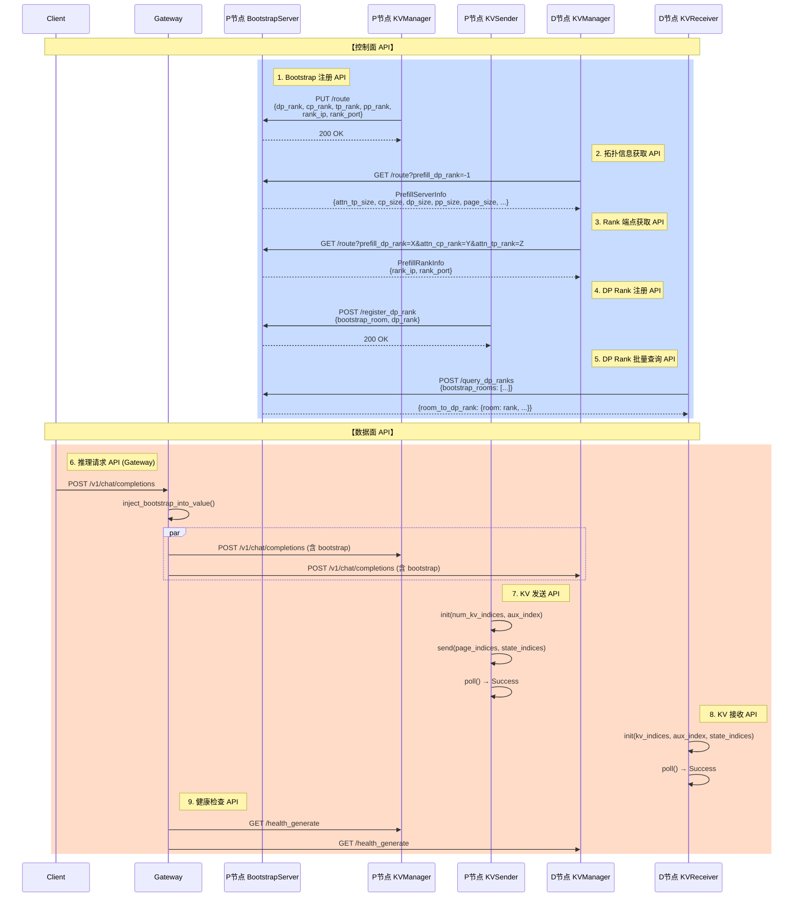
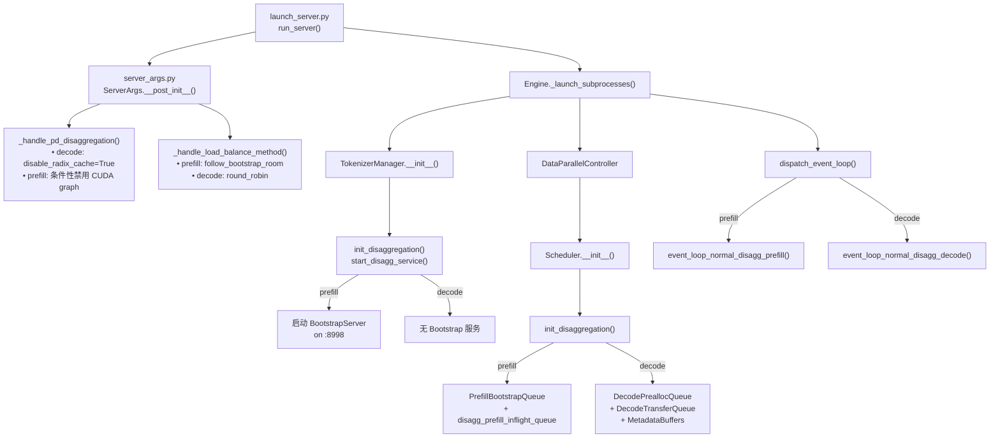

# SGLang Prefill-Decode（PD）分离架构 · 自顶向下系统性深度分析

> **基准版本**：SGLang 最新 main 分支（2026-03-30 快照）
> **分析路径**：架构动机 → 整体架构 → 组件职责 → 控制面交互 → 数据面交互 → 总控制器设计权衡 → 通信 API → 核心代码实现 → 补充与纠错

---

## 一、PD 分离架构的核心动机与整体总览

### 1.1 行业痛点与设计目标

LLM 推理由两个特性截然不同的阶段构成：

| 阶段 | 计算特征 | 瓶颈 |
|------|---------|------|
| **Prefill**（预填充） | 处理完整输入序列，计算密集（Compute-bound） | GPU 算力 |
| **Decode**（解码） | 逐 token 自回归生成，访存密集（Memory-bound） | GPU 显存带宽与 KV Cache 容量 |

在传统"统一引擎"（Unified Engine）中，Prefill 与 Decode 在同一 GPU 上交替调度，产生两大核心问题：

1. **Prefill 中断（Prefill Interruption）**：新到达的 Prefill 请求频繁打断正在进行的 Decode 批次，导致 Decode 延迟（TPOT / ITL）剧烈抖动
2. **DP Attention 负载失衡**：在 Data-Parallel Attention 模式下，一个 DP Worker 处理 Prefill、另一个处理 Decode，两者计算量差异巨大，导致短板效应

**SGLang PD 分离架构的核心设计目标**：

- **阶段隔离**：Prefill 与 Decode 运行在独立节点/进程，消除相互干扰
- **独立优化**：P 节点可以针对计算吞吐优化（大 batch、高 GPU 利用率）；D 节点可以针对延迟与 KV Cache 管理优化
- **弹性伸缩**：P 节点与 D 节点可以独立扩缩容，适配不同负载模式
- **高效 KV 传输**：通过 RDMA（Mooncake / NIXL / Mori）或 NVLink 实现 P→D 的 KV Cache 零拷贝传输

### 1.2 整体架构总览



### 1.3 核心组件职责边界

#### 1.3.1 Prefill Node（P 节点）

| 模块 | 代码路径 | 职责 |
|------|---------|------|
| HTTP Server | `srt/entrypoints/http_server.py` | 接收 Gateway 转发的 Prefill 请求，PD 特化的 warmup 与 health check |
| TokenizerManager | `srt/managers/tokenizer_manager.py` | 文本分词、启动 BootstrapServer（`start_disagg_service`）、携带 bootstrap 元数据下发 |
| DP Controller | `srt/managers/data_parallel_controller.py` | `follow_bootstrap_room` 策略：按 `bootstrap_room % dp_size` 路由到对应 DP Worker |
| Scheduler (PrefillMixin) | `srt/disaggregation/prefill.py` | Bootstrap 队列管理、Prefill 前向执行、KV 发送（`send_kv_chunk`）、传输完成轮询 |
| PrefillBootstrapQueue | `srt/disaggregation/prefill.py` | Sender 创建与握手、容量检查、pop 已就绪请求到 waiting_queue |
| KV Sender | `srt/disaggregation/{mooncake,nixl,mori}/conn.py` | 后端特化的 RDMA/NVLink KV 数据发送 |
| BootstrapServer | `srt/disaggregation/common/conn.py` | HTTP 服务（aiohttp），提供 `/route`、`/register_dp_rank`、`/query_dp_ranks` 等 API |

#### 1.3.2 Decode Node（D 节点）

| 模块 | 代码路径 | 职责 |
|------|---------|------|
| HTTP Server | `srt/entrypoints/http_server.py` | 接收 Gateway 转发的 Decode 请求 |
| TokenizerManager | `srt/managers/tokenizer_manager.py` | 文本分词，不启动 BootstrapServer |
| Scheduler (DecodeMixin) | `srt/disaggregation/decode.py` | Prealloc 队列、Transfer 队列、Prebuilt Batch 构建、Decode 前向执行 |
| DecodePreallocQueue | `srt/disaggregation/decode.py` | Receiver 创建、KV 内存预分配、与 Bootstrap 握手 |
| DecodeTransferQueue | `srt/disaggregation/decode.py` | KV 传输轮询、元数据提交（`_commit_transfer_to_req`）|
| KV Receiver | `srt/disaggregation/{mooncake,nixl,mori}/conn.py` | 后端特化的 RDMA/NVLink KV 数据接收 |
| DecodeReqToTokenPool | `srt/disaggregation/decode.py` | 扩展的 token pool，含预分配 slot |
| KVCacheOffloadManager | `srt/disaggregation/decode_kvcache_offload_manager.py` | （可选）GPU→Host→Storage 的 KV 逐步卸载 |

#### 1.3.3 SGLang Model Gateway（总控制器 / 接入层负载均衡）

> **关键设计决策**：SGLang **没有**独立的"总控制器"进程。Gateway（sgl-model-gateway，Rust 实现）同时承担了接入层负载均衡与全局调度的职能。

| 模块 | 代码路径 | 职责 |
|------|---------|------|
| PDRouter (HTTP) | `sgl-model-gateway/src/routers/http/pd_router.rs` | PD 模式下的 HTTP 请求路由、bootstrap 注入、双发（dual dispatch）、流式响应合并 |
| GrpcPDRouter | `sgl-model-gateway/src/routers/grpc/pd_router.rs` | gRPC 协议的 PD 路由 |
| WorkerRegistry | `sgl-model-gateway/src/core/worker_registry.rs` | 管理所有 Prefill/Decode Worker 的注册、健康检查、一致性哈希环 |
| ServiceDiscovery | `sgl-model-gateway/src/service_discovery.rs` | K8s Pod 监听、按 label selector 自动发现 P/D 节点 |
| PolicyRegistry | `sgl-model-gateway/src/policies/` | 路由策略管理：Random、RoundRobin、CacheAware、PowerOfTwo、Bucket 等 |
| WorkerSelectionStage | `sgl-model-gateway/src/routers/grpc/common/stages/worker_selection.rs` | gRPC pipeline 中的 P/D Worker 选择 |

#### 1.3.4 配套核心组件

| 组件 | 代码路径 | 职责 |
|------|---------|------|
| KVArgs | `srt/disaggregation/base/conn.py` | KV 缓存指针、页大小、TP/PP 信息等参数封装 |
| MetadataBuffers | `srt/disaggregation/utils.py` | 首 token hidden states、logprobs、bootstrap_room 签名等元数据的 CPU 张量缓冲 |
| CommonKVManager | `srt/disaggregation/common/conn.py` | KV 传输的连接管理、ZMQ 端点绑定、状态跟踪 |
| ReqToMetadataIdxAllocator | `srt/disaggregation/utils.py` | 元数据 buffer 索引的分配与回收 |
| ServerArgs | `srt/server_args.py` | `--disaggregation-mode`、`--disaggregation-transfer-backend` 等 CLI 参数定义 |

---

## 二、控制面交互逻辑全链路分析

### 2.1 控制面全链路时序图



### 2.2 控制面交互场景详细拆解

#### 2.2.1 节点注册与发现机制

**触发时机**：Gateway 启动时、K8s Pod 状态变化时

**交互双方**：ServiceDiscovery → WorkerRegistry

**传递信息**：
- Pod IP、端口、`worker_type`（Prefill / Decode）
- Prefill 节点额外携带 `bootstrap_port`（从 K8s annotation `sglang.ai/bootstrap-port` 读取，默认 8998）

**处理逻辑**：
1. `ServiceDiscovery::start_service_discovery()` 监听 K8s Pod 事件
2. `handle_pod_event()` 根据 `pd_mode` 和 label selector 区分 Prefill/Decode Pod
3. 通过 `Job::AddWorker` 提交到 `JobQueue`
4. `WorkerRegistry::register()` 注册 Worker 并重建一致性哈希环（`HashRing`，每个 Worker 150 个虚拟节点，blake3 哈希）

**异常节点检测与剔除**：
- `HealthChecker` 周期性 GET `/health` 或 `/health_generate`
- `CircuitBreaker` 模式：连续失败达到阈值后标记节点为 unavailable
- Pod 删除事件触发 `Job::RemoveWorker`，从 Registry 移除

**代码路径**：`sgl-model-gateway/src/service_discovery.rs` → `sgl-model-gateway/src/core/worker_registry.rs`

#### 2.2.2 Bootstrap 握手机制

**触发时机**：Decode 节点首次接收到指向特定 Prefill 节点的请求时

**交互双方**：DecodePreallocQueue (D 节点) → BootstrapServer (P 节点)

**传递信息**：
- D→P：请求 `PrefillServerInfo`（拓扑信息）和各 rank 的 ZMQ 端点
- P→D：`attn_tp_size`、`attn_cp_size`、`dp_size`、`pp_size`、`page_size`、`kv_cache_dtype`、`follow_bootstrap_room`、各 rank 的 `{rank_ip, rank_port}`

**处理逻辑**：
1. `CommonKVManager.__init__()` 在 Decode 端绑定本地 ZMQ PULL socket
2. `try_ensure_parallel_info(bootstrap_addr)` 通过 HTTP GET 获取 `PrefillServerInfo`
3. `_resolve_rank_mapping()` 解析 TP/CP/PP rank 到 prefill rank 的映射关系
4. `CommonKVReceiver._setup_bootstrap_infos()` 循环请求各 rank 的具体 ZMQ 端点
5. 建立 ZMQ PUSH→PULL 连接，用于后续的 KV 传输协调

**代码路径**：`srt/disaggregation/common/conn.py` 中的 `CommonKVBootstrapServer`、`CommonKVManager`、`CommonKVReceiver`

#### 2.2.3 全局调度与负载均衡逻辑

**触发时机**：每个用户请求到达 Gateway 时

**交互双方**：PDRouter → PolicyRegistry → WorkerRegistry

**调度策略**：

| 策略 | 适用场景 | 核心逻辑 |
|-----|---------|---------|
| `Random` | 默认 Decode 策略 | 随机选择可用 Worker |
| `RoundRobin` | 均匀分布 | 轮询选择 |
| `CacheAware` | Prefill 缓存感知 | 前缀树匹配，优先选择已缓存前缀的节点 |
| `PowerOfTwo` | 低延迟 | 随机选 2 个，选负载较低的 |
| `Bucket` | 分组路由 | 按请求特征分桶 |

**HTTP 模式**：Prefill 和 Decode 使用**独立策略**（`--prefill-policy`、`--decode-policy`）

**gRPC 模式**：Prefill 和 Decode 使用**相同策略**，但分别在各自 Worker 池中选择

**P 节点内部 DP 调度**（`DataParallelController`）：
- 默认策略：`follow_bootstrap_room`（`bootstrap_room % dp_size`），确保同一请求的 KV 传输在正确的 DP Worker 上处理
- 支持 `routed_dp_rank` 外部指定，绕过负载均衡

**代码路径**：`sgl-model-gateway/src/routers/http/pd_router.rs` 的 `select_pd_pair()`、`srt/managers/data_parallel_controller.py` 的 `follow_bootstrap_room_scheduler()`

#### 2.2.4 容错与高可用处理

**节点故障恢复流程**：
1. `HealthChecker` 检测到节点不可达
2. `CircuitBreaker` 标记节点为不可用（`is_available() = false`）
3. 后续请求在 `select_pd_pair()` 中自动跳过不可用节点
4. Pod 恢复后 ServiceDiscovery 重新注册

**请求重试机制**：
- Gateway 层：`RetryExecutor::execute_response_with_retry` 包裹所有请求；失败时重新选择 P/D Worker 对
- KV 传输层：`KVPoll.Failed` 触发请求释放和重试（`process_disagg_prefill_inflight_queue` 中 failure 路径释放 KV 并上报错误）

**集群过载保护**：
- P 节点：`_check_if_req_exceed_kv_capacity()` 检查 KV 容量，超限拒绝
- D 节点：`_allocatable_tokens()` 扣除已预分配/传输中/等待中的 token 数，防止过度分配
- D 节点：`num_reserved_decode_tokens` 预留 token 用于 running batch

---

## 三、数据面交互逻辑全链路分析

### 3.1 单请求完整生命周期时序图



### 3.2 数据面交互阶段详细拆解

#### 3.2.1 请求接入与路由

**流转路径**：Client → Gateway PDRouter → P 节点 HTTP + D 节点 HTTP（并行双发）

**Gateway 处理逻辑**：
1. `select_pd_pair()`：从 `WorkerRegistry` 获取可用的 Prefill 和 Decode Worker 列表，分别按各自策略选择一个
2. `generate_room_id()`：生成随机 `u64`（掩码为 `i64::MAX`）作为 `bootstrap_room`，用于关联同一请求在 P/D 节点上的处理
3. `inject_bootstrap_into_value()`：将选中的 Prefill Worker 的 `bootstrap_host`、`bootstrap_port`，以及 `bootstrap_room` 注入请求 JSON
4. `execute_dual_dispatch_internal()`：**并行** POST 相同请求体到 P 和 D 节点

**关键设计**：Gateway 向 P 和 D 发送的是**同一个请求体**（含相同的 input text、sampling params 等），只是 P 节点执行 Prefill、D 节点等待 KV 传输后执行 Decode。`bootstrap_room` 是关联这对 P/D 处理的唯一标识。

**代码路径**：`sgl-model-gateway/src/routers/http/pd_router.rs`

#### 3.2.2 Prefill 阶段执行

**流转路径**：P 节点 HTTP → TokenizerManager → DP Controller → Scheduler → TP Worker

**P 节点处理逻辑**：
1. **请求入队**：`_add_request_to_queue()` 将请求放入 `PrefillBootstrapQueue`（而非普通 `waiting_queue`）
2. **Bootstrap 握手**：创建 `KVSender`，初始状态 `Bootstrapping`；`pop_bootstrapped()` 轮询直到 `WaitingForInput`
3. **max_new_tokens 限制**：`_process_req()` 强制设置 `max_new_tokens = 1`，因为 P 节点只需生成首 token
4. **Prefill 前向**：通过 `PrefillAdder` 组 batch，执行 `prepare_for_extend()` → `ForwardMode.EXTEND` 前向计算
5. **结果处理**：`process_batch_result_disagg_prefill()` 提取首 token、填充 `MetadataBuffers`、调用 `send_kv_chunk()` 发送 KV
6. **传输等待**：请求进入 `disagg_prefill_inflight_queue`，轮询 Sender 直到 `KVPoll.Success`
7. **资源释放**：`release_kv_cache()` 释放 P 节点 KV 内存，`release_req_to_metadata_buffer()` 释放元数据缓冲

**代码路径**：`srt/disaggregation/prefill.py` 的 `SchedulerDisaggregationPrefillMixin`

#### 3.2.3 P→D 节点的核心流转

**KV Cache 同步机制**：

```mermaid
flowchart LR
    subgraph Prefill["P 节点"]
        A["Prefill 前向完成"] --> B["send_kv_chunk()"]
        B --> C["kv_to_page_indices()<br/>计算页索引"]
        C --> D["MetadataBuffers.set_buf()<br/>填充首token+logprobs"]
        D --> E["KVSender.send(page_indices)"]
    end

    subgraph Transfer["传输层"]
        E --> F["RDMA Write / NVLink<br/>KV Pages 传输"]
        F --> G["Metadata 传输"]
    end

    subgraph Decode["D 节点"]
        G --> H["KVReceiver.poll() = Success"]
        H --> I["_commit_transfer_to_req()"]
        I --> J["MetadataBuffers.get_buf()<br/>读取首token+logprobs"]
        J --> K["验证 bootstrap_room 签名"]
        K --> L["req 进入 waiting_queue"]
    end
```



**传递数据**：
- **KV Cache Pages**：按 `page_size` 对齐的 KV 页索引，包含所有 attention 层的 K/V 数据
- **MetadataBuffers**：首 token hidden states（用于 EAGLE 推测解码）、首 token logprobs、`bootstrap_room` 签名（防数据损坏）
- **State（可选）**：Mamba state（`state_type="mamba"`）、SWA state（`state_type="swa"`）、NSA state（`state_type="nsa"`）

**传输后端**：

| 后端 | 传输机制 | 适用场景 |
|------|---------|---------|
| **Mooncake** | RDMA + 可选 NVLink | 默认后端，多节点 IB/RoCE |
| **NIXL** | NVIDIA NIXL 库 | NVIDIA 生态 RDMA |
| **Mori** | 自定义传输引擎 | 特定硬件优化 |
| **Ascend** | MemFabric Hybrid | 华为昇腾 NPU |
| **Fake** | 无实际传输（测试用） | 单元测试、功能验证 |

**代码路径**：`srt/disaggregation/prefill.py` 的 `send_kv_chunk()`、`srt/disaggregation/decode.py` 的 `_commit_transfer_to_req()`

#### 3.2.4 Decode 阶段执行

**D 节点处理逻辑**（四阶段队列流水线）：



1. **PreallocQueue**：创建 `KVReceiver`，解析 prefill DP rank，预分配 KV slots（`_pre_alloc`），调用 `receiver.init(page_indices)`
2. **TransferQueue**：轮询 `receiver.poll()`，成功后 `_commit_transfer_to_req()` 读取 MetadataBuffers 并提交到 Req
3. **waiting_queue**：常规等待 batch 组装
4. **Prebuilt Batch**：`prepare_for_prebuilt()` 设置 `ForwardMode.PREBUILT`（**不执行 Prefill 前向计算**），`process_prebuilt()` 设置首 token 为 output_ids，然后 merge 到 `running_batch`
5. **Decode 循环**：`prepare_for_decode()` → `ForwardMode.DECODE` → 逐 token 生成 → `stream_output` → 客户端

**token 回传路径**：D 节点 Scheduler → D 节点 HTTP Server → Gateway → Client（SSE 流式传输）

**关键设计**：D 节点在内存估算时需要扣除 `num_reserved_decode_tokens`（预留给 running batch）、prealloc 中的 token、transfer 中的 token、waiting 中的 token，确保不过度分配。

**代码路径**：`srt/disaggregation/decode.py` 的 `SchedulerDisaggregationDecodeMixin`、`srt/disaggregation/decode_schedule_batch_mixin.py`

#### 3.2.5 多轮对话场景处理

在 PD 分离架构下，多轮对话的处理流程：

1. **每轮请求独立路由**：Gateway 为每轮对话生成新的 `bootstrap_room`，可能路由到不同的 P/D 节点对
2. **KV Cache 不跨轮复用**（D 节点 `disable_radix_cache = True`）：D 节点使用 chunk cache 而非 radix cache，不依赖前缀缓存
3. **P 节点前缀缓存**：P 节点保留 radix cache，可以利用多轮对话的公共前缀（前几轮的 system prompt + 历史）减少重复计算
4. **Gateway CacheAware 策略**：若配置 `CacheAware` 策略，Gateway 会优先将同一前缀的请求路由到同一 P 节点，最大化前缀缓存命中

**控制面与数据面联动**：
- **控制面**：Gateway 根据缓存策略决定 P 节点选择
- **数据面**：每轮请求走完整的 Prefill → KV 传输 → Decode 流程

---

## 四、总控制器的设计思考与权衡深度分析

### 4.1 核心定位

SGLang 的"总控制器"功能分布在两个层级：

1. **Gateway 层（sgl-model-gateway）**：全局请求路由、P/D 节点选择、Bootstrap 注入、流式响应合并
2. **节点内 DP Controller**：节点内 DP Worker 间的请求分发

**核心要解决的问题**：
- 如何将同一请求的 Prefill 和 Decode 关联到正确的 P/D 节点对？
- 如何在 P/D 节点间平衡负载？
- 如何处理节点故障和请求重试？

### 4.2 核心设计权衡分析

#### 4.2.1 集中式 vs 分布式调度

**SGLang 选择：集中式 Gateway + 分布式节点内调度**



| 维度 | 收益 | 代价 |
|------|-----|------|
| **可扩展性** | Gateway 无状态（不持有 KV Cache），可水平扩展 | 单 Gateway 可能成为带宽瓶颈（所有请求经过） |
| **一致性** | 全局视图简单，P/D 对选择一致 | Gateway 的负载信息可能滞后 |
| **延迟** | 双发并行，Prefill/Decode 无需串行等待 Gateway | 额外一跳网络延迟 |
| **容错** | Gateway 可独立重启，不影响已建立的 KV 传输 | Gateway 单点故障风险（可多实例部署缓解） |

**设计原因**：
- Gateway 是 Rust 实现的轻量代理，不参与 GPU 计算，性能开销极低
- `bootstrap_room` 机制将 P/D 关联下沉到节点间直接通信，Gateway 无需维护全局 KV 传输状态
- 双发（Dual Dispatch）设计使得 P 和 D 节点可以**并行启动准备**，而非串行等待

#### 4.2.2 调度策略的设计权衡

**Prefill 调度策略**：

| 权衡维度 | CacheAware 策略 | Random/RoundRobin 策略 |
|----------|----------------|----------------------|
| **前缀缓存命中率** | 高（前缀树匹配） | 低（随机分散） |
| **负载均衡** | 可能不均（热点前缀集中） | 均匀 |
| **延迟** | 缓存命中时低，不命中时与 Random 相同 | 稳定 |
| **实现复杂度** | 高（维护前缀树、mesh 同步） | 低 |

**Decode 调度策略**：
- 默认 `RoundRobin`：D 节点无前缀缓存，无需考虑缓存局部性
- `PowerOfTwo`：选负载最低的，适合延迟敏感场景

**KV 缓存局部性 vs 全局负载均衡的权衡**：
- P 节点使用 `follow_bootstrap_room` 确保同一请求的所有 DP Worker 上的 KV 在同一位置
- Gateway 层可独立配置 Prefill/Decode 策略，允许 P 侧重缓存、D 侧重均衡

#### 4.2.3 状态管理的设计权衡

**SGLang 选择：最终一致性模型**

| 状态类型 | 一致性模型 | 设计选择 |
|---------|-----------|---------|
| Worker 注册 | K8s 事件驱动 + 本地缓存 | 最终一致，Pod 事件可能延迟 |
| 节点健康 | 周期性心跳 + CircuitBreaker | 最终一致，检测延迟取决于心跳周期 |
| 负载信息 | 请求级 WorkerLoadGuard | 近实时（基于 RAII），但 Gateway 侧不知道节点内部队列深度 |
| KV 传输状态 | 节点间直接 poll | P/D 节点间强一致（ZMQ + RDMA 同步） |

**收益**：
- 无需分布式锁或共识协议，Gateway 保持无状态
- KV 传输的关键一致性下沉到 P/D 节点间，由 RDMA 硬件保证
- Gateway 只做 best-effort 路由，实际流量控制由各节点 Scheduler 自行管理

**代价**：
- Gateway 可能将请求路由到已过载的节点（信息滞后）
- 节点故障检测有延迟窗口

#### 4.2.4 可扩展性的设计权衡

**大规模集群支持**：
- Gateway 无状态，可部署多实例 + 外部 LB（如 K8s Ingress）
- `HashRing` 一致性哈希支持动态扩缩容
- `ServiceDiscovery` 支持 K8s 原生 label selector 自动发现
- P/D 节点独立扩缩，P:D 比例可按负载调整

**取舍**：
- 不支持跨 Gateway 实例的全局状态共享（各 Gateway 独立维护 WorkerRegistry）
- `CacheAware` 策略在多 Gateway 实例下可能导致缓存不一致（通过 mesh 同步缓解）

### 4.3 与行业主流框架对比

| 维度 | SGLang | vLLM | TensorRT-LLM |
|------|--------|------|-------------|
| **PD 分离模式** | 原生支持，Gateway + 独立 P/D 进程 | 通过 disaggregated prefill 支持 | 通过 Executor 分离支持 |
| **控制器架构** | Rust Gateway（无状态代理） | Python Router | C++ Orchestrator |
| **KV 传输** | Mooncake/NIXL/Mori RDMA | NCCL/Nixl | NCCL/自定义传输 |
| **调度策略** | 可插拔策略注册（6+ 内置） | 固定策略 | 固定策略 |
| **Bootstrap 机制** | HTTP Bootstrap Server + ZMQ | - | - |
| **双发设计** | 是（P/D 同时接收请求） | 否（串行） | 否（串行） |
| **K8s 原生支持** | ServiceDiscovery + label selector | 需外部配置 | 需外部配置 |
| **请求关联机制** | bootstrap_room（随机 ID） | 内部 request ID | 内部 request ID |

**SGLang 的核心差异化**：
1. **双发（Dual Dispatch）设计**：P 和 D 节点同时接收请求，D 节点可提前进行 KV 预分配和握手，减少串行等待
2. **可插拔传输后端**：统一的 `BaseKVSender/Receiver` 抽象，支持多种 RDMA/NVLink 后端热切换
3. **Gateway 与引擎解耦**：Rust Gateway 独立于 Python 引擎，性能开销极低
4. **Prebuilt Batch**：D 节点使用 `ForwardMode.PREBUILT` 跳过 Prefill 前向，直接复用传输的 KV

---

## 五、通信交互 API 的定义与调用逻辑全解析

### 5.1 通信协议与序列化方式

| 通信路径 | 协议 | 序列化 |
|---------|------|--------|
| Client → Gateway | HTTP/gRPC | JSON / Protobuf |
| Gateway → P/D 节点 | HTTP/gRPC | JSON（注入 bootstrap 字段）/ Protobuf |
| D 节点 → P 节点 Bootstrap | HTTP (aiohttp) | JSON |
| P/D 节点间 KV 协调 | ZMQ (PUSH/PULL) | pickle / msgspec |
| P→D KV 数据传输 | RDMA / NVLink | 原始内存指针（零拷贝） |
| 节点内 Scheduler↔TP Worker | ZMQ | pickle |

### 5.2 核心 API 全链路调用时序图



### 5.3 控制面 API 详细定义

#### API 1: Bootstrap 注册（PUT /route）

| 属性 | 说明 |
|-----|------|
| **代码文件** | `srt/disaggregation/common/conn.py` → `CommonKVBootstrapServer` |
| **功能** | Prefill Worker 向 BootstrapServer 注册自身的 TP/CP/DP/PP rank 信息和 ZMQ 端点 |
| **所属面** | 控制面 |
| **调用方** | `CommonKVManager.register_to_bootstrap()` (Prefill 端) |
| **被调用方** | `CommonKVBootstrapServer` (Prefill 端 aiohttp 服务) |
| **触发时机** | Prefill 节点 Scheduler 初始化时 |
| **请求体** | `{prefill_dp_rank, attn_cp_rank, attn_tp_rank, pp_rank, rank_ip, rank_port}` |
| **响应体** | `200 OK` |

#### API 2: 拓扑信息获取（GET /route?prefill_dp_rank=-1）

| 属性 | 说明 |
|-----|------|
| **代码文件** | `srt/disaggregation/common/conn.py` → `CommonKVBootstrapServer`、`CommonKVManager.try_ensure_parallel_info()` |
| **功能** | Decode 端获取 Prefill 集群的并行拓扑信息 |
| **所属面** | 控制面 |
| **调用方** | `CommonKVManager.try_ensure_parallel_info()` (Decode 端) |
| **被调用方** | `CommonKVBootstrapServer` (Prefill 端) |
| **触发时机** | Decode 端首次处理指向该 Prefill 节点的请求时 |
| **请求参数** | `prefill_dp_rank=-1`（表示查询全局拓扑而非特定 rank） |
| **响应体** | `PrefillServerInfo {attn_tp_size, attn_cp_size, dp_size, pp_size, page_size, kv_cache_dtype, follow_bootstrap_room}` |
| **依赖** | 需要所有 Prefill rank 完成注册后才能返回完整信息 |

#### API 3: Rank 端点获取（GET /route?prefill_dp_rank=X&...）

| 属性 | 说明 |
|-----|------|
| **代码文件** | `srt/disaggregation/common/conn.py` → `CommonKVReceiver._setup_bootstrap_infos()` |
| **功能** | 获取特定 Prefill rank 的 ZMQ 通信端点 |
| **所属面** | 控制面 |
| **调用方** | `CommonKVReceiver.__init__()` (Decode 端) |
| **被调用方** | `CommonKVBootstrapServer` (Prefill 端) |
| **触发时机** | Decode Receiver 初始化时，为每个需要通信的 Prefill rank 获取端点 |
| **请求参数** | `{prefill_dp_rank, attn_cp_rank, attn_tp_rank, pp_rank}` |
| **响应体** | `PrefillRankInfo {rank_ip, rank_port}` |

#### API 4: DP Rank 注册（POST /register_dp_rank）

| 属性 | 说明 |
|-----|------|
| **代码文件** | `srt/disaggregation/common/conn.py` → `CommonKVSender.__init__()` |
| **功能** | 多 DP 场景下，Prefill Sender 向 BootstrapServer 注册 bootstrap_room 与 DP rank 的映射 |
| **所属面** | 控制面 |
| **调用方** | `CommonKVSender.__init__()` (Prefill 端，非 `follow_bootstrap_room` 模式) |
| **被调用方** | `CommonKVBootstrapServer` |
| **触发时机** | Prefill Sender 创建时（多 DP、非 follow_bootstrap_room 场景） |
| **请求体** | `{bootstrap_room, dp_rank}` |
| **响应体** | `200 OK` |

#### API 5: DP Rank 批量查询（POST /query_dp_ranks）

| 属性 | 说明 |
|-----|------|
| **代码文件** | `srt/disaggregation/common/conn.py` → `CommonKVReceiver.query_prefill_dp_ranks()` |
| **功能** | Decode 端批量查询多个 bootstrap_room 对应的 Prefill DP rank |
| **所属面** | 控制面 |
| **调用方** | `DecodePreallocQueue._resolve_pending_reqs()` (Decode 端) |
| **被调用方** | `CommonKVBootstrapServer` |
| **触发时机** | Decode 端无法直接确定 prefill DP rank 时 |
| **请求体** | `{bootstrap_rooms: [room1, room2, ...]}` |
| **响应体** | `{room_to_dp_rank: {room1: rank1, room2: rank2, ...}}` |

### 5.4 数据面 API 详细定义

#### API 6: 推理请求（POST /v1/chat/completions 等）

| 属性 | 说明 |
|-----|------|
| **代码文件** | `sgl-model-gateway/src/routers/http/pd_router.rs` → `route_chat()`；`srt/entrypoints/http_server.py` |
| **功能** | 客户端推理请求，Gateway 双发到 P/D 节点 |
| **所属面** | 数据面 |
| **调用方** | Client → Gateway → P/D 节点 |
| **请求体（Gateway 注入后）** | `{messages, model, stream, ..., bootstrap_host, bootstrap_port, bootstrap_room}` |
| **Prefill 响应** | 首 token + input logprobs（若请求 logprobs） |
| **Decode 响应** | SSE 流式 token 序列 |
| **Gateway 合并逻辑** | `merge_logprobs_in_json()` / `merge_streaming_logprobs()` 将 Prefill 的 input logprobs 与 Decode 的 output 合并 |

#### API 7: KV Sender 接口

| 属性 | 说明 |
|-----|------|
| **代码文件** | `srt/disaggregation/base/conn.py` → `BaseKVSender`；各后端 `{mooncake,nixl,mori}/conn.py` |
| **功能** | Prefill 端发送 KV Cache 到 Decode 端 |
| **所属面** | 数据面 |
| **核心方法** | `init(num_kv_indices, aux_index)` → `send(page_indices, state_indices)` → `poll() → KVPoll` |
| **KVPoll 状态** | `Bootstrapping(1)` → `WaitingForInput(2)` → `Transferring(3)` → `Success(4)` / `Failed(0)` |
| **触发时机** | Prefill 前向完成后，`process_batch_result_disagg_prefill()` 调用 `send_kv_chunk()` |

#### API 8: KV Receiver 接口

| 属性 | 说明 |
|-----|------|
| **代码文件** | `srt/disaggregation/base/conn.py` → `BaseKVReceiver`；各后端实现 |
| **功能** | Decode 端接收 KV Cache |
| **所属面** | 数据面 |
| **核心方法** | `init(kv_indices, aux_index, state_indices)` → `poll() → KVPoll` → `clear()` / `abort()` |
| **触发时机** | `DecodePreallocQueue.pop_preallocated()` 调用 `receiver.init()`，之后在 `DecodeTransferQueue.pop_transferred()` 中 poll |

#### API 9: 健康检查（GET /health_generate）

| 属性 | 说明 |
|-----|------|
| **代码文件** | `srt/entrypoints/http_server.py`；`sgl-model-gateway/src/routers/http/pd_router.rs` → `health_generate()` |
| **功能** | 验证 P/D 节点的推理健康状态 |
| **所属面** | 控制面 |
| **处理逻辑** | PD 模式下使用 `FAKE_BOOTSTRAP_HOST` + `bootstrap_room=0` 构造虚拟请求测试端到端 |
| **Gateway 侧** | 同时检查 Prefill 和 Decode 节点的健康 |

### 5.5 核心 API 实现逻辑解析

#### Bootstrap 注册与路由解析

`CommonKVBootstrapServer` 在 Prefill 端运行，使用 aiohttp：

```
PUT /route → prefill_port_table[dp][cp][tp][pp] = {rank_ip, rank_port}
GET /route?prefill_dp_rank=-1 → 返回 PrefillServerInfo（需所有 rank 注册完成）
GET /route?prefill_dp_rank=X&cp=Y&tp=Z&pp=W → 查找 prefill_port_table 返回端点
```

`CommonKVManager.register_to_bootstrap()` 将本节点的 ZMQ PULL socket 地址注册到 Bootstrap。Decode 端的 `try_ensure_parallel_info()` 通过 HTTP GET 拉取拓扑，超时重试（`bootstrap_timeout` 环境变量可配）。

#### KV 传输 Sender/Receiver 生命周期

**Sender 生命周期**：
1. `__init__`: 状态 `Bootstrapping`，对于 dummy CP rank 直接 `WaitingForInput`
2. `init(num_kv_indices, aux_index)`: 通知 Receiver 预期的 KV 长度和元数据索引
3. `send(page_indices, state_indices)`: 触发 RDMA Write（Mooncake）或 NIXL transfer
4. `poll()`: 检查传输状态，返回 `KVPoll`
5. 成功后 Prefill 端释放 KV；失败则 abort

**Receiver 生命周期**：
1. `__init__`: 状态 `Bootstrapping`，HTTP 获取 Prefill 拓扑，建立 ZMQ 连接
2. `init(kv_indices, aux_index, state_indices)`: 通知 Sender 本端的 KV slot 地址
3. `poll()`: 检查接收状态
4. 成功后 `_commit_transfer_to_req()` 提交元数据到 Req
5. `clear()` / `abort()`: 清理或中止

#### 跨 rank 一致性：poll_and_all_reduce

`poll_and_all_reduce(pollers, gloo_group)` 使用 Gloo **MIN all_reduce** 在 TP group 内同步 poll 状态，确保所有 rank 看到一致的传输状态（取最差值，任一 rank 失败则全部失败）。

对于 CP（Context Parallelism）场景，`poll_and_all_reduce_attn_cp_tp_group()` 先在 TP group 内 MIN reduce，再在 CP group 内 MIN reduce。

---

## 六、PD 分离核心代码实现自顶向下拆解

### 6.1 代码目录结构

```
python/sglang/srt/
├── server_args.py                          # PD CLI 参数定义
├── entrypoints/
│   └── http_server.py                      # HTTP 入口，PD warmup/health
├── managers/
│   ├── tokenizer_manager.py                # 分词 + Bootstrap 启动
│   ├── data_parallel_controller.py         # DP 调度 (follow_bootstrap_room)
│   ├── scheduler.py                        # 调度器主体 (含 PD mixin 组合)
│   ├── schedule_batch.py                   # Batch 构建 (含 Prebuilt mixin)
│   ├── disagg_service.py                   # Bootstrap 服务启动入口
│   └── prefill_delayer.py                  # Prefill 延迟器
├── disaggregation/
│   ├── base/
│   │   ├── __init__.py                     # 导出 BaseKV* 和 KVPoll
│   │   └── conn.py                         # 抽象基类：KVArgs, KVPoll, BaseKVManager/Sender/Receiver/BootstrapServer
│   ├── common/
│   │   ├── conn.py                         # 通用实现：CommonKVManager/Sender/Receiver/BootstrapServer
│   │   └── utils.py                        # FastQueue, group_concurrent_contiguous
│   ├── mooncake/
│   │   ├── __init__.py
│   │   └── conn.py                         # Mooncake RDMA 后端
│   ├── nixl/
│   │   ├── __init__.py
│   │   └── conn.py                         # NIXL 后端
│   ├── mori/
│   │   ├── __init__.py
│   │   └── conn.py                         # Mori 后端
│   ├── ascend/
│   │   ├── __init__.py
│   │   ├── conn.py                         # Ascend 后端
│   │   └── transfer_engine.py
│   ├── fake/
│   │   ├── __init__.py
│   │   └── conn.py                         # 测试用 Fake 后端
│   ├── prefill.py                          # P节点 Scheduler Mixin + PrefillBootstrapQueue
│   ├── decode.py                           # D节点 Scheduler Mixin + Prealloc/Transfer 队列
│   ├── decode_schedule_batch_mixin.py      # D节点 Prebuilt Batch 构建
│   ├── decode_kvcache_offload_manager.py   # D节点 KV 卸载管理
│   ├── kv_events.py                        # KV 生命周期事件（HiCache 集成）
│   ├── utils.py                            # MetadataBuffers, TransferBackend, get_kv_class, 工具函数
│   ├── encode_server.py                    # EPD: 多模态编码服务
│   ├── encode_receiver.py                  # EPD: 编码结果接收
│   └── encode_grpc_server.py               # EPD: gRPC 编码服务

sgl-model-gateway/src/
├── main.rs                                 # Gateway 入口
├── server.rs                               # HTTP/gRPC 服务器
├── service_discovery.rs                    # K8s 节点发现
├── core/
│   ├── worker.rs                           # Worker 抽象（含 WorkerType::Prefill/Decode）
│   ├── worker_registry.rs                  # Worker 注册与哈希环
│   ├── worker_manager.rs                   # Worker 生命周期管理
│   └── job_queue.rs                        # 异步任务队列
├── routers/
│   ├── http/
│   │   ├── pd_router.rs                    # HTTP PD 路由器
│   │   └── pd_types.rs                     # PD 类型定义
│   └── grpc/
│       ├── pd_router.rs                    # gRPC PD 路由器
│       └── common/stages/
│           └── worker_selection.rs         # Worker 选择阶段
└── policies/
    ├── cache_aware.rs                      # 缓存感知策略
    ├── random.rs                           # 随机策略
    ├── round_robin.rs                      # 轮询策略
    ├── power_of_two.rs                     # 双选策略
    └── bucket.rs                           # 分桶策略
```

### 6.2 启动入口与初始化逻辑

#### 6.2.1 P/D 节点启动

**入口文件**：`python/sglang/launch_server.py` → `srt/entrypoints/http_server.py`

**启动命令**：
```bash
# Prefill 节点
python -m sglang.launch_server --model-path <model> --disaggregation-mode prefill --port 30000

# Decode 节点
python -m sglang.launch_server --model-path <model> --disaggregation-mode decode --port 30001
```

**初始化流程**：



**关键初始化步骤**：

1. **`ServerArgs._handle_pd_disaggregation()`**：
   - Decode 节点：`disable_radix_cache = True`（使用 chunk cache）
   - Prefill 节点：若 piecewise CUDA graph 禁用，则整体禁用 CUDA graph

2. **`TokenizerManager.init_disaggregation()`**：
   - 调用 `start_disagg_service(server_args)` → 仅 Prefill 端启动 `CommonKVBootstrapServer`

3. **`Scheduler.init_disaggregation()`**：
   - Decode 端：创建 `MetadataBuffers`、`DecodeTransferQueue`、`DecodePreallocQueue`、`ReqToMetadataIdxAllocator`
   - Prefill 端：创建 `MetadataBuffers`、`PrefillBootstrapQueue`、空 `disagg_prefill_inflight_queue`

4. **`dispatch_event_loop()`**：根据 `disaggregation_mode` 选择事件循环：
   - Prefill：`event_loop_normal_disagg_prefill` / `event_loop_overlap_disagg_prefill` / `event_loop_pp_disagg_prefill`
   - Decode：`event_loop_normal_disagg_decode` / `event_loop_overlap_disagg_decode` / `event_loop_pp_disagg_decode`

#### 6.2.2 Gateway 启动

**入口**：`sgl-model-gateway/src/main.rs` 或 Python CLI `sglang_router.launch_router`

**启动命令**：
```bash
python -m sglang_router.launch_router \
    --pd-disaggregation \
    --prefill http://P_NODE:30000 \
    --decode http://D_NODE:30001 \
    --host 0.0.0.0 --port 8000
```

### 6.3 总控制器核心代码

#### 6.3.1 Gateway PDRouter 核心逻辑

**`select_pd_pair()`**（`sgl-model-gateway/src/routers/http/pd_router.rs`）：
1. 从 `WorkerRegistry` 获取 Prefill/Decode Worker 列表
2. 按模型过滤（若启用 IGW multi-model）
3. 过滤可用 Worker（`is_available()`）
4. 分别使用 `get_prefill_policy()` 和 `get_decode_policy()` 选择一个 Worker
5. 返回 `(prefill_worker, decode_worker)` 对

**`inject_bootstrap_into_value()`**：
1. 从选中的 Prefill Worker 获取 `bootstrap_host`（Worker IP）和 `bootstrap_port`
2. 调用 `generate_room_id()` 生成随机 `bootstrap_room`
3. 将三个字段注入请求 JSON（单请求或 batch）

**`execute_dual_dispatch_internal()`**：
1. 构建发往 P 和 D 的 HTTP 请求（相同 body，不同 URL）
2. **并行发送**（tokio::join 或类似机制）
3. 处理 Prefill 响应：提取 `meta_info`（含 input logprobs）
4. 处理 Decode 响应：流式转发或整体返回
5. 若需要 logprobs 合并：`merge_logprobs_in_json()` 或 `merge_streaming_logprobs()`

#### 6.3.2 节点内 DP Controller

**`follow_bootstrap_room_scheduler()`**（`srt/managers/data_parallel_controller.py`）：
- 核心：`target_rank = req.bootstrap_room % len(self.workers)`
- 确保同一 `bootstrap_room` 的请求路由到同一 DP Worker，与 KV 传输的 DP rank 对齐
- 支持 `routed_dp_rank` 外部覆盖（`maybe_external_dp_rank_routing`）

### 6.4 P 节点核心代码

#### 6.4.1 PrefillBootstrapQueue

**核心职责**：管理 KV Sender 的创建和握手

**`add(req, num_kv_heads)`**（`srt/disaggregation/prefill.py`）：
1. `_check_if_req_exceed_kv_capacity()` 检查 KV 容量
2. 创建 `kv_sender_class` 实例（FAKE 模式用 `FAKE_BOOTSTRAP_HOST` 判断）
3. 设置 `req.disagg_kv_sender`
4. `_process_req()` 强制 `max_new_tokens = 1`

**`pop_bootstrapped()`**：
1. `poll_and_all_reduce_attn_cp_tp_group()` 同步所有 TP/CP rank 的 Sender 状态
2. 状态为 `WaitingForInput` 的 Sender → 分配 `metadata_buffer_index` → `sender.init()` → 返回就绪请求

#### 6.4.2 send_kv_chunk

**`send_kv_chunk(req, last_chunk, end_idx)`**：
1. 从 `req_to_token_pool` 获取 KV 索引（`kv_indices`）
2. `kv_to_page_indices()` 按 `page_size` 对齐成页索引
3. CP 场景：`filter_kv_indices_for_cp_rank()` 过滤 rank 所属的页
4. Hybrid 模型（Mamba/SWA/NSA）：收集 `state_indices`
5. 最后一个 chunk：`MetadataBuffers.set_buf(req)` 填充首 token/logprobs 元数据
6. `req.disagg_kv_sender.send(page_indices, state_indices)` 触发 RDMA 传输

#### 6.4.3 Prefill 事件循环

**`event_loop_normal_disagg_prefill()`**：
```
while True:
    recv_requests()                          # 接收新请求
    process_input_requests()                 # 处理输入
    bootstrapped = pop_bootstrapped()        # 取已握手完成的请求
    waiting_queue.extend(bootstrapped)       # 放入等待队列
    batch = get_next_disagg_prefill_batch()  # 组 batch
    if batch:
        run_batch(batch)                     # Prefill 前向
        process_batch_result(batch, result)  # 发送 KV
    process_disagg_prefill_inflight_queue()  # 轮询传输完成
```

### 6.5 D 节点核心代码

#### 6.5.1 DecodePreallocQueue

**`pop_preallocated()`**（`srt/disaggregation/decode.py`）：
1. `_update_handshake_waiters()` 更新握手状态
2. 计算 `_allocatable_tokens()` 可分配 token 数
3. 按请求遍历：`_pre_alloc(req)` 分配 KV slot → `receiver.init(page_indices)` 告知 Sender
4. 返回 `(ready_list, failed_list)`

**`_allocatable_tokens()`**：
```
max_tokens - reserved_decode_tokens - running_tokens - transfer_tokens - waiting_tokens - retracted_tokens
```

#### 6.5.2 Prebuilt Batch 构建

**`prepare_for_prebuilt()`**（`srt/disaggregation/decode_schedule_batch_mixin.py`）：
1. 设置 `ForwardMode.PREBUILT`
2. 类似 `prepare_for_extend` 构建张量，但**不调用 `alloc_for_extend`**（KV 已由传输填充）
3. 复制 `req_to_token_pool` 行、构建 `input_ids`/`seq_lens`/`out_cache_loc`
4. 创建 `SamplingBatchInfo`

**`process_prebuilt()`**：
1. 将 Prefill 端传输的首 token 设置为 `output_ids`
2. `tree_cache.cache_unfinished_req()` 缓存
3. Grammar `accept_token` 处理
4. EAGLE 推测解码：构建 `EagleDraftInput`

#### 6.5.3 Decode 事件循环

**`event_loop_normal_disagg_decode()`**：
```
while True:
    recv_requests()
    process_input_requests()
    process_decode_queue()                     # prealloc → transfer → waiting
    batch = get_next_disagg_decode_batch()     # prebuilt + merge running
    if batch:
        run_batch(batch)
        process_batch_result(batch, result)
```

**`process_decode_queue()`**：
1. （可选）`offload_manager` 处理 KV 卸载
2. `resume_retracted_reqs()` 恢复回收的请求
3. `pop_preallocated()` → 新请求加入 Transfer 队列
4. `pop_transferred()` → 完成传输的请求加入 waiting_queue

### 6.6 接入层负载均衡核心代码

#### 6.6.1 路由逻辑

**HTTP PDRouter**（`sgl-model-gateway/src/routers/http/pd_router.rs`）：
- `route_generate` / `route_chat` / `route_completion` 均走 `execute_dual_dispatch()`
- 内部调用 `select_pd_pair()` + `inject_bootstrap_into_value()` + `execute_dual_dispatch_internal()`

**gRPC PD Pipeline**（`sgl-model-gateway/src/routers/grpc/pd_router.rs`）：
- `WorkerSelectionStage` 的 `PrefillDecode` 模式
- `select_pd_pair()` 使用单一策略在 Prefill/Decode 池中分别选择

#### 6.6.2 负载均衡算法

**CacheAware**（`sgl-model-gateway/src/policies/cache_aware.rs`）：
- 维护**前缀树**（per-worker），记录每个 Worker 缓存的 token 前缀
- 选择时：计算请求前缀与各 Worker 缓存的最长匹配
- 负载不平衡时退化到 shortest queue
- 支持 mesh 同步（多 Gateway 实例间同步前缀树状态）

### 6.7 关键代码片段解读

#### MetadataBuffers 的设计

`MetadataBuffers`（`srt/disaggregation/utils.py`）是 P→D 传输元数据的关键组件：

- 预分配固定大小的 CPU 张量数组：`hidden_states_buf[size, hidden_size]`、`top_logprobs_p_buf`、`top_logprobs_id_buf` 等
- 每个请求分配一个 `metadata_buffer_index`（通过 `ReqToMetadataIdxAllocator`）
- **`set_buf(req)`**（Prefill 端）：将首 token hidden states、logprobs、EAGLE 元数据、`bootstrap_room`（作为完整性签名）写入对应 slot
- **`get_buf(idx)`**（Decode 端）：读取传输后的元数据，验证 `bootstrap_room` 一致性

#### bootstrap_room 的完整性验证

在 `DecodeTransferQueue._commit_transfer_to_req()` 中：
```python
if bootstrap_room != decode_req.req.bootstrap_room:
    # 数据损坏检测：传输的 metadata 中的 room 不匹配
    # → 释放 KV，标记请求失败
```

这是一个轻量级的数据完整性校验机制，防止 RDMA 传输中的元数据错乱。

#### poll_and_all_reduce 的共识机制

`poll_and_all_reduce(pollers, gloo_group)` 实现了 TP group 内的分布式共识：
1. 每个 rank 本地 poll 自己的 Sender/Receiver
2. 使用 Gloo **MIN** all_reduce 同步状态（uint8 张量）
3. 取最差值：任一 rank 的 Sender/Receiver 失败 → 所有 rank 看到 Failed
4. 可选注入故障：`DISAGGREGATION_TEST_FAILURE_PROB` 环境变量随机触发 Failed（测试用）

---

## 七、针对初始分析思路的补充与纠错

### 7.1 遗漏的核心环节与关键逻辑

初始思路"分析 P/D 节点/LoadBalance 服务的控制面/数据面交互，明确总控制器设计权衡、API 调用逻辑"遗漏了以下关键环节：

1. **双发（Dual Dispatch）设计**：这是 SGLang PD 架构最核心的设计特征之一。Gateway 不是先发 Prefill、等 KV 传输完成后再发 Decode，而是**同时**向 P 和 D 发送相同请求。D 节点在等待 KV 传输时可以提前进行握手、内存预分配等准备工作，显著减少端到端延迟。

2. **Prebuilt Batch 机制**：D 节点不重新执行 Prefill 前向，而是创建 `ForwardMode.PREBUILT` 的特殊 batch，直接复用传输的 KV Cache。这需要特殊的 batch 构建逻辑（`prepare_for_prebuilt`）和结果处理（`process_prebuilt`）。

3. **MetadataBuffers 传输**：除了 KV Cache 本身，还需要传输首 token hidden states（用于 EAGLE 推测解码）、logprobs、采样状态等元数据。这些通过独立的 `MetadataBuffers` 机制传输。

4. **多级队列流水线**：D 节点的请求经过四级队列（Prealloc → Transfer → Waiting → Running），每级有独立的资源管理和状态跟踪逻辑。

5. **CP/PP 支持**：PD 分离不仅支持 TP（张量并行），还支持 CP（上下文并行）和 PP（流水线并行），涉及复杂的 rank 映射和分阶段 KV 传输。

6. **DP Controller 的 follow_bootstrap_room 策略**：确保同一请求在 DP 维度上的一致路由，是连接 Gateway 路由与节点内 KV 传输的关键纽带。

7. **EPD（Encode-Prefill-Decode）扩展**：PD 分离进一步扩展为三阶段分离，支持多模态编码的独立计算和传输。

### 7.2 认知偏差与误区纠正

1. **❌ 误区："存在独立的总控制器进程"**
   ✅ 纠正：SGLang **没有**独立的总控制器进程。Gateway（sgl-model-gateway）是一个 Rust 实现的轻量级反向代理 / 路由器，它同时承担了接入层负载均衡和全局调度职能。它不持有任何 GPU 资源或 KV Cache 状态。

2. **❌ 误区："KV Cache 通过 Gateway 中转传输"**
   ✅ 纠正：KV Cache 通过 RDMA/NVLink 在 P 和 D 节点间**直接传输**，不经过 Gateway。Gateway 只负责注入 `bootstrap_host/port/room` 让 P/D 节点能互相发现。

3. **❌ 误区："Decode 节点需要等待 Prefill 完成后才开始准备"**
   ✅ 纠正：Gateway 的双发设计使得 D 节点在收到请求后**立即**开始握手和内存预分配，与 P 节点的 Prefill 计算**并行**进行。

4. **❌ 误区："P/D 节点是完全不同的代码"**
   ✅ 纠正：P 和 D 节点运行**相同的 SGLang 服务器代码**，通过 `--disaggregation-mode prefill/decode` 参数区分行为。核心差异通过 Scheduler 的 Mixin 模式注入：`SchedulerDisaggregationPrefillMixin` 和 `SchedulerDisaggregationDecodeMixin`。

5. **❌ 误区："Gateway 做全局 KV 传输状态管理"**
   ✅ 纠正：KV 传输的状态完全由 P/D 节点间通过 `bootstrap_room` 和 KVPoll 机制管理。Gateway 是**无状态**的（除了 WorkerRegistry 和 PolicyRegistry），不跟踪单个请求的 KV 传输进度。

6. **❌ 误区："D 节点使用 Radix Cache 做前缀缓存"**
   ✅ 纠正：D 节点在 PD 模式下**强制禁用** Radix Cache（`disable_radix_cache = True`），使用简单的 Chunk Cache。因为 D 节点的 KV 来自传输而非本地计算，前缀缓存意义不大。

### 7.3 SGLang PD 分离架构总结

#### 核心优势

1. **双发并行设计**：P/D 节点同时准备，最小化端到端延迟
2. **可插拔传输后端**：统一抽象 + 多后端（Mooncake/NIXL/Mori/Ascend），适配不同硬件生态
3. **Mixin 架构**：P/D 行为通过 Mixin 注入 Scheduler，代码复用度高，维护成本低
4. **Gateway 解耦**：Rust 实现的高性能无状态代理，不增加 GPU 负担
5. **K8s 原生集成**：ServiceDiscovery + label selector + bootstrap annotation，云原生部署友好
6. **多并行维度支持**：TP + CP + PP + DP 全覆盖
7. **推测解码兼容**：MetadataBuffers 传输 EAGLE 所需的 hidden states 和 top-k 信息

#### 现存局限性

1. **D 节点无前缀缓存**：每次 Decode 都需要完整的 KV 传输，多轮对话无法复用 D 端 KV
2. **Gateway 负载信息滞后**：Gateway 不知道节点内部队列深度，路由决策可能不够精准
3. **bootstrap_room 单点**：`CommonKVBootstrapServer` 运行在 Prefill 节点上，该节点故障会影响新请求的 KV 建立（已传输的请求不受影响）
4. **传输开销**：RDMA 传输引入额外网络带宽消耗和延迟，对于短序列请求可能得不偿失
5. **调试复杂度**：跨节点调试难度大，需要协调 P/D 两端的日志和状态

#### 适用场景

| 场景 | 适用性 | 原因 |
|------|--------|------|
| 长输入+短输出（如摘要、分析） | ⭐⭐⭐ | Prefill 计算密集，分离后可独立扩容 |
| 高并发在线推理 | ⭐⭐⭐ | 消除 Prefill 对 Decode 的干扰 |
| DeepSeek 等超大模型 | ⭐⭐⭐ | 多节点部署，TP/PP 与 PD 分离结合 |
| 短输入+长输出（如代码生成） | ⭐⭐ | Prefill 轻量，分离收益有限但 Decode 优化仍有价值 |
| 低延迟批量推理 | ⭐ | KV 传输开销可能抵消分离收益 |
| 单 GPU 部署 | ❌ | 无需分离 |
